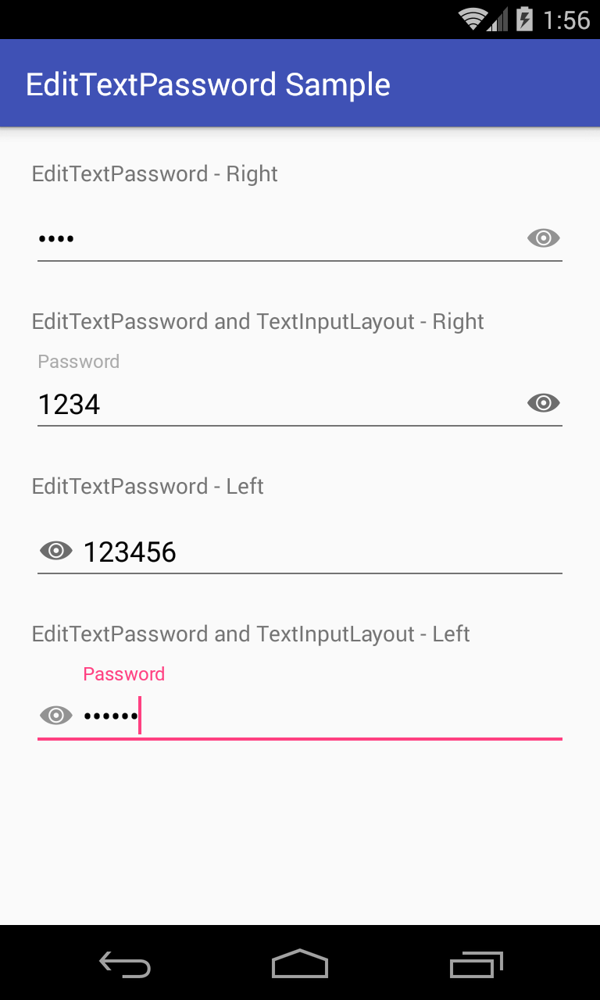

android-edittextpassword
===============

EditTextPassword is a Android library that allows to show/hide the password in the EditText. You can set a icon on the right or on the left side of the Edit Text.
The icon works like a toggle, once clicked it show/hide the password.



Target platforms
---

- API level 14 or later

Latest version
---

- Version 1.0.0  (APR. 12, 2016)

Usage
---

In order to use the library, there are 2 different options:

**1. Gradle dependency** (recommended)

 - 	Add the following to your `build.gradle`:
 ```gradle
repositories {
	    jcenter()
}

dependencies {
	   compile 'com.marlonmafra.android.widget:edittext-password:1.0.0'
}
```

**2. Maven**
- Add the following to your `pom.xml`:

 ```xml
<dependency>
      <groupId>com.marlon.android.widget</groupId>
      <artifactId>edittext-password</artifactId>
      <version>1.0.0</version>
      <type>pom</type>
</dependency>
```

**3. Ivy**

 ```xml
<dependency org='com.marlonmafra.android.widget' name='edittext-password' rev='1.0.0'/>
```

# Sample usage

It works like a EditText.

```xml
  <com.marlonmafra.android.widget.EditTextPassword
         android:layout_width="match_parent"
         android:layout_height="wrap_content"
         android:hint="Password"
         android:inputType="textPassword"
         android:textColor="@android:color/black"
         android:textColorHint="@android:color/darker_gray"
         app:iconPosition="right"
         app:hidePasswordIcon="@drawable/ic_hide_password"
         app:showPasswordIcon="@drawable/ic_show_password"
         app:fontPath="fonts/roboto_regular.ttf" />
```

## Customization

You can customize the component according with attributes shown below

| Attribute             | Default       | Values  |
| ----------------------|:-------------:| -----:|
| app:iconPosition      | right         | right / left |
| app:showPasswordIcon  |  | Drawable image |
| app:hidePasswordIcon  |  | Drawable image |
| app:fontPath          | N/A      |    font path |

License
---

	Copyright (c) 2016 Marlon Mafra

    Licensed under the Apache License, Version 2.0 (the "License");
    you may not use this file except in compliance with the License.
    You may obtain a copy of the License at

    http://www.apache.org/licenses/LICENSE-2.0

    Unless required by applicable law or agreed to in writing, software
    distributed under the License is distributed on an "AS IS" BASIS,
    WITHOUT WARRANTIES OR CONDITIONS OF ANY KIND, either express or implied.
    See the License for the specific language governing permissions and
    limitations under the License.

